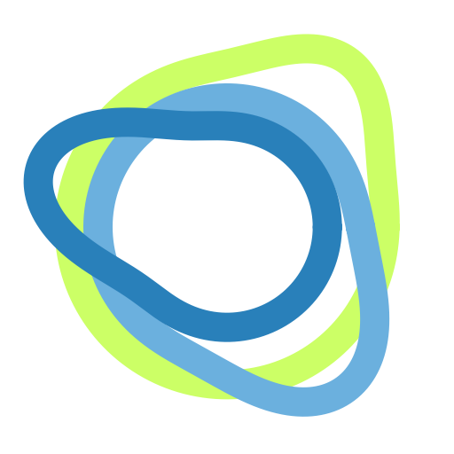

[](https://pypi.org/project/circleclust/)
[](https://pypi.org/project/circleclust/)
[](https://opensource.org/licenses/MIT)
[](https://circleclust.readthedocs.io/en/latest/?badge=latest)


<h1><p align="left">
  
  <span style="font-size:2.5em; vertical-align: middle;"><b>CircleClust</b></span>
</p></h1>

Clustering on periodic circular coordinates with automatic detection of centroids and boundary handling.

# Installation

```bash
pip install circleclust
```

# Why CircleClust?

Standard clustering algorithms don't account for periodicity - values near boundaries wrap around. CircleClust handles this by detecting clusters that cross periodic boundaries.

## Use Case 1: Image Color Hues

Cluster color hues from an image. Red hues near 0°/360° boundary require circular distance metrics.

```python
from circleclust import CircleClust
import numpy as np

# Load color hues from an image
hues = np.array([350, 355, 358, 2, 5, 180, 185, 190])  # Red cluster at boundary
clust = CircleClust(data=hues, period=360, verbose=True)
clust.fit(hues, period=360)
labels = clust.predict(hues)

# Visualize
clust.show_peaks(output="hist_hues.png")
```


## Use Case 2: Go-to-Sleep Times

Cluster sleep onset times near midnight boundary.

```python
# Load sleep data (times in minutes past midnight)
sleep_times = [23*60+45, 23*60+50, 23*60+55, 0, 5, 10]  # Midnight boundary

clust = CircleClust(data=sleep_times, period=24*60, verbose=True)
clust.fit(sleep_times, period=24*60)
labels = clust.predict(sleep_times)

# Visualize
clust.show_peaks(output="hist_sleep.png")
```


# Features

- **Automatic window size detection** using train/test RMSD minimization
- **Circular boundary handling** - clusters crossing 0/period are correctly identified
- **Period-aware clustering** - works with any period (radians, degrees, hours, minutes)
- **Visualization tools** - plot peaks, centroids, and clusters
- **Robust peak detection** - identifies distribution peaks on periodic axes

# Quick Start

```python
from circleclust import CircleClust
import numpy as np

# Example: cluster angles in radians
angles = np.array([0.1, 0.2, 0.3, 5.9, 6.0, 3.1, 3.2])

# Create and fit model
clust = CircleClust(verbose=True)
clust.fit(angles, period=2*np.pi)

# Predict cluster labels
labels = clust.predict(angles)

# Visualize results
clust.show_peaks(output="clusters.png")
```

# API Reference

## CircleClust

Main class for circular clustering.

### Parameters

- `data` (Iterable[float], optional): Data to fit immediately upon construction
- `period` (float, default 2π): Period of input values; data is wrapped into [0, period)
- `window` (float, optional): Manual override for smoothing window width
- `max_screen_divisor` (int, default 32): Maximum divisor k in window screening
- `max_screen_iter` (int, default 2): Number of screening repetitions
- `train_frac` (float, default 0.7): Training fraction during screening
- `random_seed` (int, default 0): Random seed for reproducibility
- `verbose` (bool, default False): Enable informational prints

### Methods

- `fit(data, period=None)`: Fit the model to data
- `predict(x)`: Predict cluster labels for input values
- `show_peaks(color, title, output)`: Visualize detected peaks
- `show_centroids(output)`: Show centroids
- `show_clusters(output)`: Show clusters

### Attributes

- `centroid_`: Array of detected cluster centers
- `centroid_radius_`: Array of cluster radii (2-sigma)
- `peak_idx_`: Indices of peaks in histogram
- `peak_sigma_`: Widths of detected peaks

# Documentation

[https://circleclust.readthedocs.io](https://circleclust.readthedocs.io)
