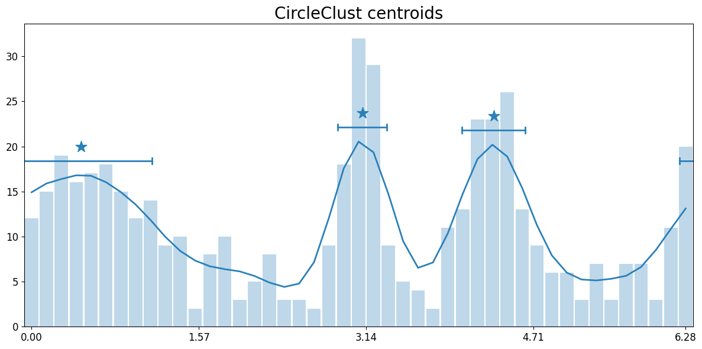

CircleClust
===========

**Clustering on periodic circular coordinates with automatic detection of centroids and boundary handling.**

Standard clustering algorithms don't account for periodicity - values near boundaries wrap around. CircleClust handles this by detecting clusters that cross periodic boundaries.

Installation
------------

.. code-block:: bash

   pip install circleclust

Why CircleClust?
----------------

Standard clustering algorithms don't account for periodicity - values near boundaries wrap around. CircleClust handles this by detecting clusters that cross periodic boundaries.

Features
--------

- **Automatic window size detection** using train/test RMSD minimization
- **Circular boundary handling** - clusters crossing 0/period are correctly identified
- **Period-aware clustering** - works with any period (radians, degrees, hours, minutes)
- **Visualization tools** - plot centroids means and stds
- **Robust peak detection** - identifies distribution peaks on periodic axes

Quick Start
-----------

.. code-block:: python

   import numpy as np
   import pandas as pd
   from circleclust import CircleClust

   url = "https://raw.githubusercontent.com/timpyrkov/circleclust/refs/heads/master/tests/sample.csv"

   # Read sample data csv: 500 data points in range [0, 2π)
   df = pd.read_csv(url)
   data = df['x'].values

   # Create and fit model
   clust = CircleClust(verbose=True)
   clust.fit(data, period=2*np.pi)

   # Get detected centroids
   clust.get_centroids()
   # Output: {'centroid': array([0.46530696, 3.1074802 , 4.34047566]),
   #          'std': array([0.66322512, 0.2304881 , 0.29800344])}

   # Predict cluster labels
   labels = clust.predict(data)
   np.unique(labels, return_counts=True)
   # Output: (array([-1,  0,  1,  2]), array([179, 150,  81,  90]))

   # Visualize results
   clust.show_peaks(output="clusters.png")

Examples
--------

Color Hue Clustering
~~~~~~~~~~~~~~~~~~~~

Cluster pixel hues from an image, correctly handling the red color boundary.

**Notebook:** :doc:`Color Wheel Example <notebooks/colorwheel>`

This example demonstrates how CircleClust correctly identifies red clusters that span the 0°/360° boundary, treating pixels near both boundaries as a single cluster.

Sleep Pattern Analysis
~~~~~~~~~~~~~~~~~~~~~~

Analyze go-to-sleep and wake-up times near midnight.

**Notebook:** :doc:`Sleep-Wake Pattern Example <notebooks/sleepwake>`

This example shows how to detect sleep patterns that cross the day boundary at midnight, properly clustering late-night and early-morning bedtimes.

API Reference
-------------

CircleClust Class
~~~~~~~~~~~~~~~~~

Main class for circular clustering with automatic peak detection.

Constructor Parameters
^^^^^^^^^^^^^^^^^^^^^^

- ``data`` (Iterable[float], optional): Data to fit immediately upon construction
- ``period`` (float, default 2π): Period of input values; data is wrapped into [0, period)
- ``window`` (float, optional): Manual override for smoothing window width
- ``max_screen_divisor`` (int, default 32): Maximum divisor k in window screening
- ``max_screen_iter`` (int, default 2): Number of screening repetitions
- ``train_frac`` (float, default 0.7): Training fraction during screening
- ``random_seed`` (int, default 0): Random seed for reproducibility
- ``verbose`` (bool, default False): Enable informational prints

Main Methods
^^^^^^^^^^^^

- :meth:`fit() <circleclust.circleclust.CircleClust.fit>`: Fit the model to data. *Important: provide correct period range for data values!*
- :meth:`predict() <circleclust.circleclust.CircleClust.predict>`: Predict cluster labels for input data points (returns array of integers, -1 for outliers)
- :meth:`get_centroids() <circleclust.circleclust.CircleClust.get_centroids>`: Get detected centroids as a dict with 'centroid' (means) and 'std' (standard deviations) arrays
- :meth:`show_peaks() <circleclust.circleclust.CircleClust.show_peaks>`: Visualize detected peaks on a histogram plot
- :meth:`show_centroids() <circleclust.circleclust.CircleClust.show_centroids>`: Alias for show_peaks()

Usage Tips
^^^^^^^^^^

1. **Provide the correct period**: Your data must be within [0, period). Make sure your period matches your data domain (e.g., ``2*np.pi`` for radians, ``360`` for degrees, ``24*60`` for minutes in a day)

2. **Let the algorithm find the optimal window**: Unless you have domain knowledge, let CircleClust automatically detect the optimal smoothing window

3. **Check for outliers**: Points labeled ``-1`` in the predict output are outliers not assigned to any cluster

.. toctree::
   :maxdepth: 2
   :caption: Contents

   Home <self>

.. toctree::
   :maxdepth: 2
   :caption: Color Wheel

   notebooks/colorwheel

.. toctree::
   :maxdepth: 2
   :caption: Sleep-Wake Time

   notebooks/sleepwake

.. toctree::
   :maxdepth: 2
   :caption: API Reference

   api/modules
